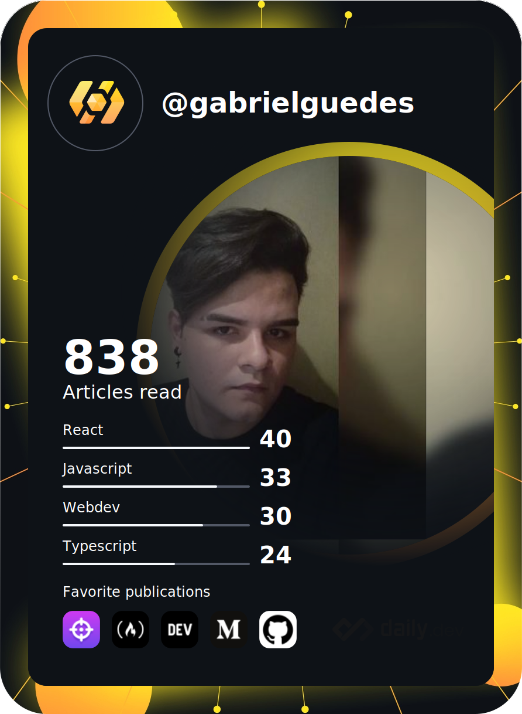
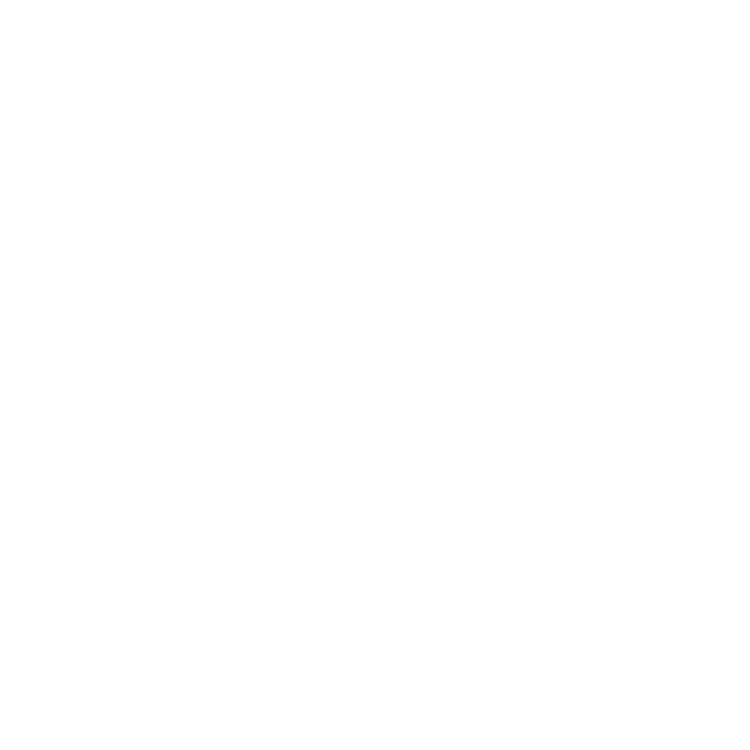
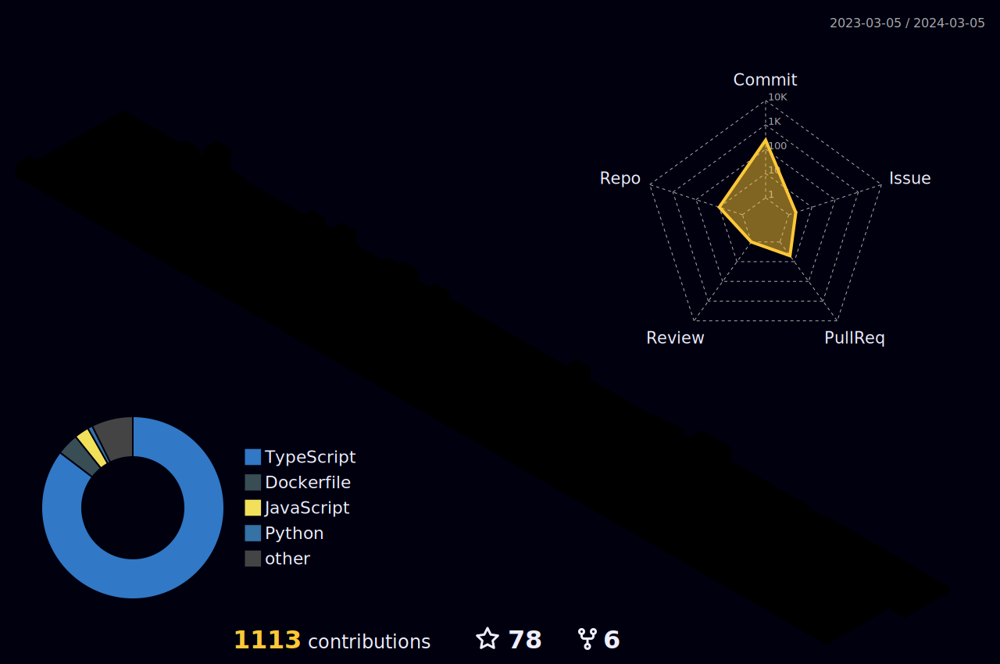
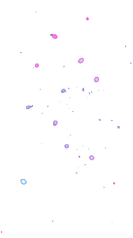

  

  

  

##

 
 

- 🖥️ Análise e Desenvolvimento de Sistemas - Fatec Jales.
- 👨‍🏫 Administrativo e TI na FAG Transportadora.
- 💻 Desenvolvedor Full Stack.
- 🚀 Apaixonada por Front End e aprimorando minhas habilidades no Back End.
- 🏡 Sou Brasileira, moro em Jales-SP.

  

 

  

  

 

 

  

## 📈 Análise de Desenvolvimento Semanal

 
 

<h3>:zap: Recent GitHub Activity</h3>

<!--RECENT_ACTIVITY:start-->
1. ⬆️ Pushed 1 commit(s) to [AngelicaRafaela/AngelicaRafaela](https://github.com/AngelicaRafaela/AngelicaRafaela) 
2. ⭐ Starred [willianjusten/nba-nextjs](https://github.com/willianjusten/nba-nextjs) 
3. ⬆️ Pushed 1 commit(s) to [AngelicaRafaela/NextJs-Boilerplate](https://github.com/AngelicaRafaela/NextJs-Boilerplate) 
4. ⬆️ Pushed 1 commit(s) to [AngelicaRafaela/TMS-Web](https://github.com/AngelicaRafaela/TMS-Web) 
5. ⬆️ Pushed 1 commit(s) to [AngelicaRafaela/CodeLeap](https://github.com/AngelicaRafaela/CodeLeap) 
6. ⬆️ Pushed 1 commit(s) to [AngelicaRafaela/NextJs-Boilerplate](https://github.com/AngelicaRafaela/NextJs-Boilerplate) 
7. ⬆️ Pushed 1 commit(s) to [AngelicaRafaela/AngelicaRafaela](https://github.comAngelicaRafaela/AngelicaRafaela) 
8. ⬆️ Pushed 1 commit(s) to [AngelicaRafaela/TMS-Web](https://github.com/AngelicaRafaela/TMS-Web) 
9. ⬆️ Pushed 1 commit(s) to [AngelicaRafaela/CodeLeap](https://github.com/AngelicaRafaela/CodeLeap) 
10. ⬆️ Pushed 1 commit(s) to [AngelicaRafaela/AngelicaRafaela](https://github.com/AngelicaRafaela/AngelicaRafaela) 
<!--RECENT_ACTIVITY:end-->

<!--RECENT_ACTIVITY:last_update-->

Last refresh: <b>Wednesday, March 6th, 2024, 1:35:35 PM BRT</b>
<!--RECENT_ACTIVITY:last_update_end-->

  
<h3>:bookmark: DevCard</h3>

  

  

  

  

 

##

 

 

 

 

  
  

 

  
 

  

  

  

  

 

)

)

 
 
 

 

 
 
 

<h2 align="center">🤝 Support</h2>

💜 If you like my projects, Give them ⭐ and Share it with friends!

Made with ❤️ in Brazil 

<h1 align="center">⚡️<i>Stay awesome!</i>⚡️</h1>

  

